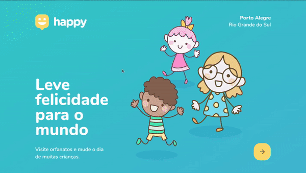
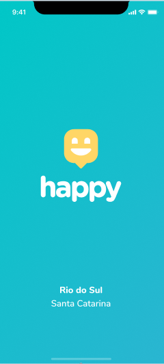
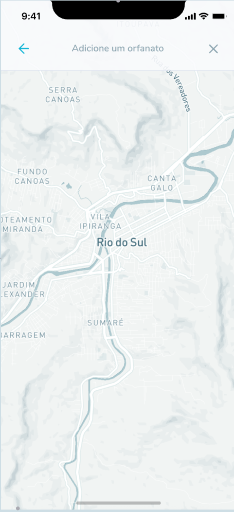
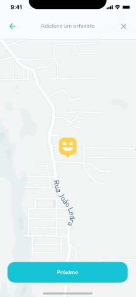
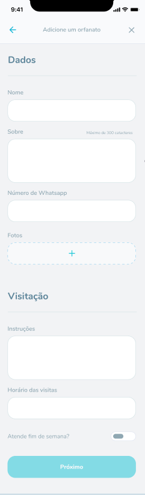
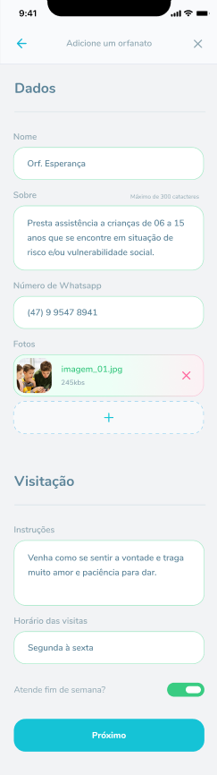
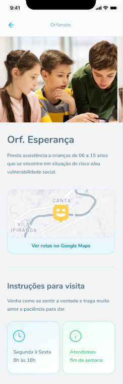

<p align="center">
  
</p>


# :pushpin: Índice
<!--ts-->
   * [Sobre](#sobre)
   * [O que é Next Level Week?](#nlw)
   * [Preview do Projeto](#preview)
   * [Tecnologias](#tecnologias)
   * [Como rodar o projeto](#run)
      * [Ligar a API](#api)
      * [Visualizar WebSite](#website)
      * [Rodar projeto no celular](#mob)
   * [Licença](#license)
<!--te-->


<h1 name="sobre">ℹ Sobre o Projeto</h1>
Projeto Happy foi construido durante esta semana do dia 12 a 18 de outubro de 2020 na Next Level Week. <br>
Happy é um projeto em homenagem ao dia das crianças onde nele é possível ver os orfanatos na sua cidade e criar agendar horarios para visitas. (As crianças adoram visitas) <br><br>


<h1 name="nlw">📣 O que é Next Level Week?</h1>

<p> 
 O NLW (antiga onmistack) é uma semana onde a <strong>Rocketseat</strong> mostram como montar uma aplicação do zero com as melhores tecnologias do mercado.
<br>
A Rocketseat tem a consciência que a prática é a melhor aula, então sempre nos inspiram e lançam desafios para a gente se virar sozinho!
</p>
<strong>Pilhares do metódo de ensino Rocketseat</strong><br>
<li><strong>Foco: </strong> Dominar todas as linguagens e tecnologias é impossível, por isso é importante focar para ir direto ao ponto sem perder tempo.</li>
<li><strong>Grupo: </strong> A comunidade de devs é uma das melhores comunidades que existem! Trabalhar em grupo é essencial, já perdi a conta de quantas vezes ajudei e fui ajudado com erros de programação.</li>
<li><strong>Prática: </strong> E claro, não podia faltar! Quando vemos uma aula, nós podemos entender os conceitos, mas só na prática que aprendemos realmente como faze-los! </li>

<h1 name="preview">🖼️ Preview do Projeto</h1>

<h3>💻 Web</h3>


<h3>📱 Mobile</h3>

<p align="center">
  
  
  
<p>
<p align="center">
  
  
  
<p>
  
<h1 name="tecnologias">🚀 Tecnologias</h1>

As seguintes ferramentas foram usadas na construção do projeto:

- [Expo](https://expo.io/)
- [Node.js](https://nodejs.org/en/)
- [React](https://pt-br.reactjs.org/)
- [React Native](https://reactnative.dev/)
- [TypeScript](https://www.typescriptlang.org/)


<h1 name="run">:construction_worker: Como rodar o projeto</h1> <br>

```bash
# Clone Repository
$ git clone https://github.com/JonathanKBP/Happy.git
```

<h3 name='api'>📦 Ligar a API</h3><br>

```bash
# Vá até a pasta
$ cd backend

# Instale as dependencias
$ yarn

# Ligue a API
$ yarn dev
```
Access API at http://localhost:3333/

<h3 name='website'>💻 Visualizar WebSite</h3><br>

```bash
# Vá até a pasta
$ cd web

# Instale as dependencias
$ yarn

# Ligue o servidor
$ yarn start
```
Vá para http://localhost:3000/ para ver o website.

<h3 name='mob'>📱 Rodar projeto no celular</h3><br>
Para ver o projeto no celular você precisa ter o <a href="https://play.google.com/store/apps/details?id=host.exp.exponent">expo</a> instalado ou um emulador android/ios.
<br />
Depois, fork esse repositorio ou clone em sua máquina. Dentro do projeto rode os comandos:

```bash
# Ir para a pasta
$ cd mobile

# Instale as dependencias
$ yarn

# Ligue o App
$ yarn start
```
Irá abrir uma aba no seu navegador e apacerá um QR Code, se escanear ele no aplicativo Expo, abrirá a aplicação. Terá uma opção para rodar em um emulador também.


<h1 name="license">:memo: License</h1>

Esse projeto está sob a licença MIT. Veja o arquivo [LICENSE](./LICENSE) para mais detalhes.


Desafios https://www.notion.so/Vers-o-2-0-do-Happy-c754db7a4d41469e8c2d00fcf75392c4
